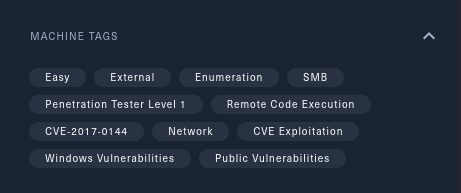

# Blue - Eternal Blue

Une petite box des plus simple utilisant une exploitation de la CVE 2017-0144 (Eternal Blue), je vais expliquer ici comment j’ai réussi cette box.

# 1. Reconning

Les tags de la machine nous donnes une idée de la vulnérabilité à exploiter ici la CVE-2017-0144.
Lançon un scan nmap sur la machine pour essayer de récupérer quelques informations.

Nous avons ici des informations intéressante, la 1er la version de la machine cible (Windows 7) ce qui nous dirige de plus en plus vers la piste de la CVE-2017-0144. Et la 2nd étant le noms de la machine “Haris-PC”, surement un utilisateur de la machine.

Recherchons maintenant dans metasploit si il existe un exploit pour notre CVE.

Super ! Nous avons notre exploit !

# 2. **Gaining Access**

Nous donnons comme valeur à RHOST l’ip de la machine cible et pour LHOST notre ip local (tun0). Et nous lançons l’exploit, ici nous comme chanceux l’exploit fonctionne et nous voilà sur la machine. 
En général les dossiers utilisateurs windows sont stocker dans “C:\Users\”. Essayons d’y aller.

Nous y voilà ! Plus qu’as afficher les flags !

Et nous retrouvons le fameux Haris du début !
