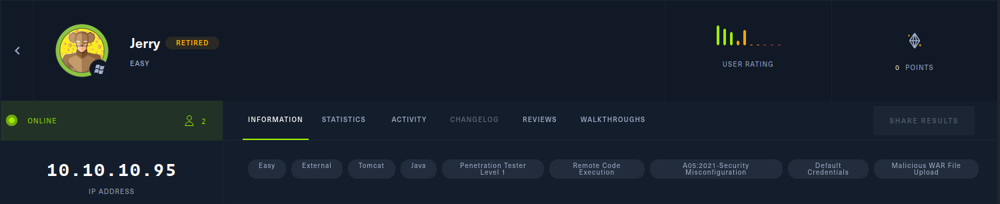

# Jerry - Easy

Une autre box windows, ici nous allons essayer de réussir à exploiter une faiblesse dans la configuration de Tomcat.

# 1. Reconning



Comme nous pouvons observer ici les tags de la machines nous donne encore une fois des pistes : 

- Tomcat
- Misconfiguration

Lançons tout d’abord nmap pour essayer de récupérer des informations plus précise.


Effectivement on peut observer ici que Tomcat tourne sur le port 8080 allons voir ce que c’est dans le navigateur.


On observe un button intéressant essayons de cliquer sur “manager app”.


Et forcément in formulaire de login, mais comme nous pouvons le voir cette page laisse penser que l’instalation de tomcat est toute fraiche. Cherchons sur internet une liste de credentials par défaut.
Après quelques recherches nous tombons sur : [https://github.com/danielmiessler/SecLists/blob/master/Passwords/Default-Credentials/tomcat-betterdefaultpasslist.txt](https://github.com/danielmiessler/SecLists/blob/master/Passwords/Default-Credentials/tomcat-betterdefaultpasslist.txt)

 Avec ceci nous pouvons crée ou trouver un exploit en python pour brute force le formulaire de connexion :

([https://github.com/b33lz3bub-1/Tomcat-Manager-Bruteforce](https://github.com/b33lz3bub-1/Tomcat-Manager-Bruteforce) → celui que j’ai utilisé) 

Et en voici un autre proposer dans les WU de HTB qui marche tout aussi bien.

```python
#!/usr/bin/env python
import sys
import requests
with open('tomcat-betterdefaultpasslist.txt') as f:
for line in f:
    c = line.strip('\n').split(":")
    r = requests.get('http://10.10.10.95:8080/manager/html', auth=(c[0], c[1]))
    if r.status_code == 200:
        print "Found valid credentials \"" + line.strip('\n') + "\""
raise sys.exit()
```


Et voilà nous avons enfin les credentials de l’interface manager !

# 2. **Gaining Access**

A partir d’ici j’utilise metasploit pour voir l’exploitation manuel je vous revois ici : 

[http://youtube.com/watch?v=PJeBIey8gc4](http://youtube.com/watch?v=PJeBIey8gc4)

Après quelques recherches sur internet sur comment exploiter les informations que nous avions je suis tomber sur un articule parlant d’un exploit nommé : “tomcat_mgr_upload”.
Cherchons dans metasploit si il existe.


Bingo nous avons notre exploit, remplissons les champs options manquant avec les bonnes adresse IP et le bon port et en avant pour lancer l’exploitation.


We are IN ! Et encore une fois aucune forme d’élévation de privilège ou de pivoting nous avons directement accès aux flags contenu dans Bureau du compte administrateur.


Affichons les flags et GG!


