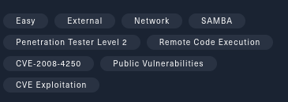

# Legacy - Easy

Legacy est une box similaire à Blue, ici on utilise metasploit et la CVE-2008-4250. Une box très accessible pour les débutants.

# 1. Reconning

Nous voyons ci-dessus que nous aurons besoins de la CVE-2008-4250.

Suite à un scan nmap nous pouvons observé que le port 135 (port par défaut de RPC) est ouvert ce qui nous amène à penser de plus en plus à la CVE-2008-4250, de plus les versions coincide ici un windows xp.

Cherchons sur exploitdb “CVE-2008-4250” et nous arrivons sur cette page. On apprend que la vulnérabilité ce nomme “MS08-067”.

Cherchons donc “MS08-067” dans metasploit. Bingo, on y trouve un exploit !

# 2. **Gaining Access**

Une fois l’exploit paramétré avec les valeurs RHOST (IP de la cible) et LHOST (IP de notre interface tun0), lançons l’exploit pour vérifier si la machine est vulnérable.

Bingo ! We are in ! Et nous voilà dans le dossier system32 de la machine cible.

Essayons de trouver le dossier contenant les espaces perso des utilisateurs de la machine.

Après être remonter à la racine (C:\) nous trouvons se dossier contenant le home admin et utilisateur.

Affichons les flags contenu sur le bureau de chaque utilisateur.

Et voilà nous avons nos deux flags !